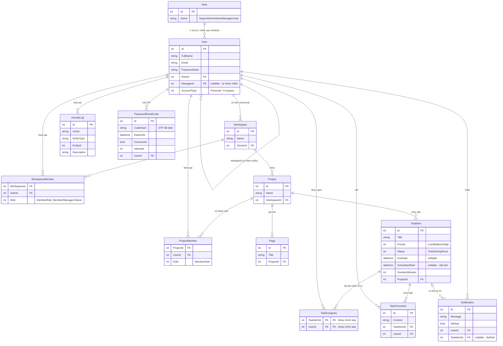
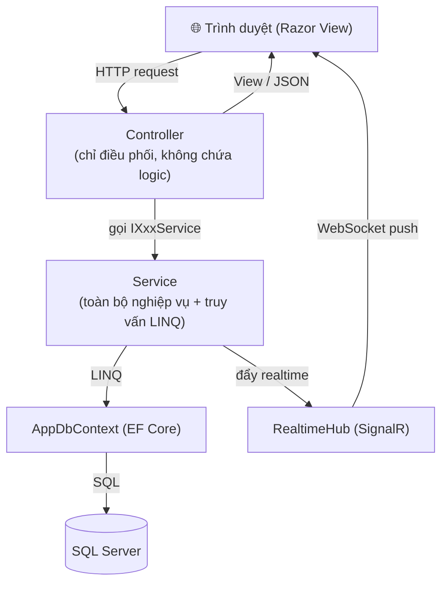
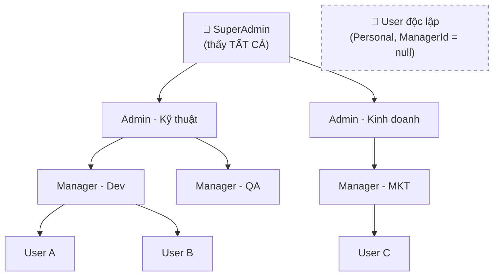
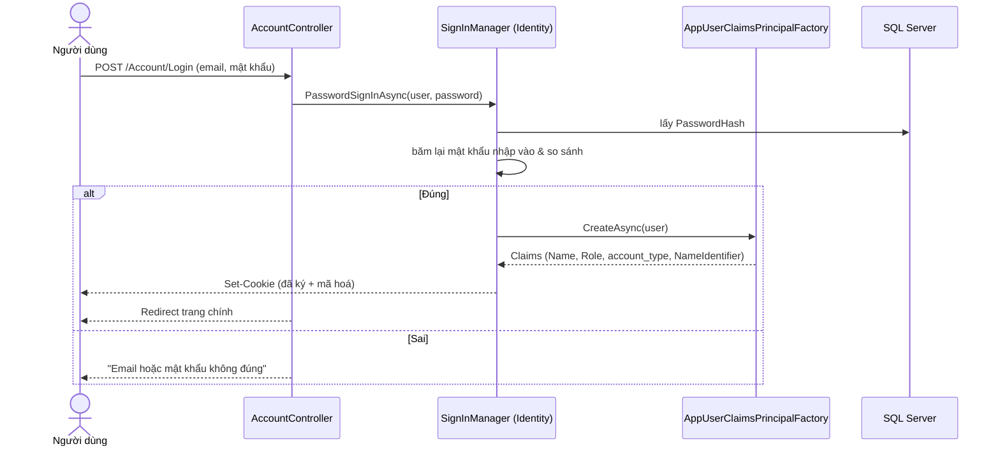
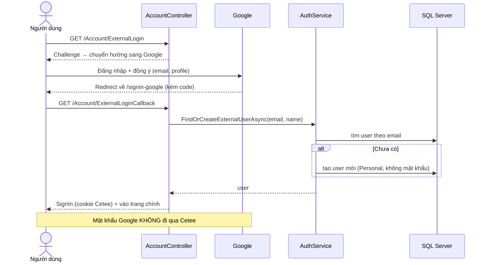
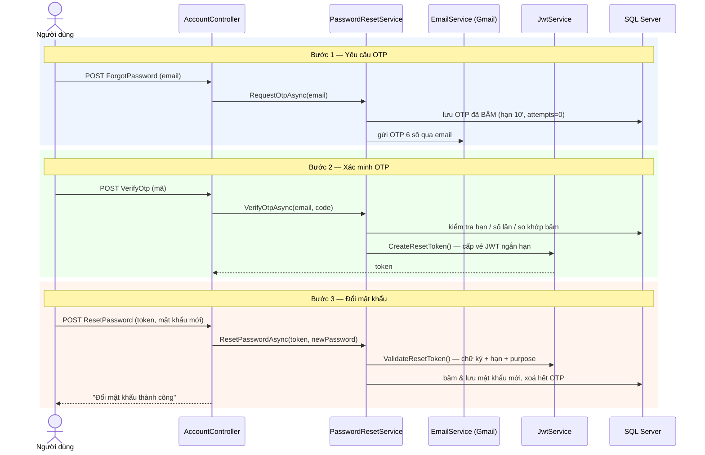
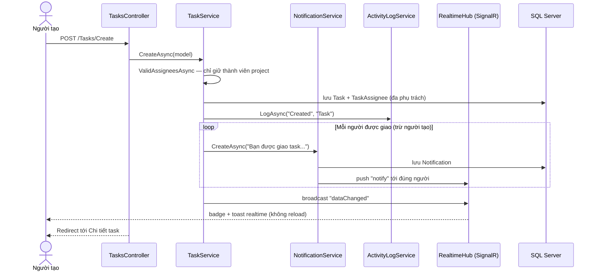
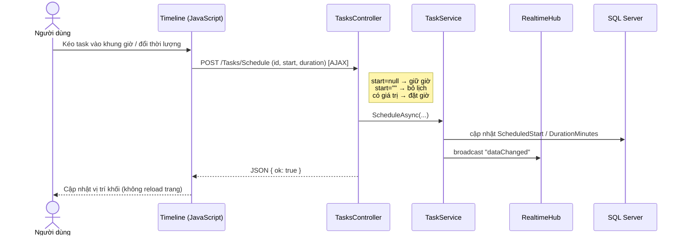
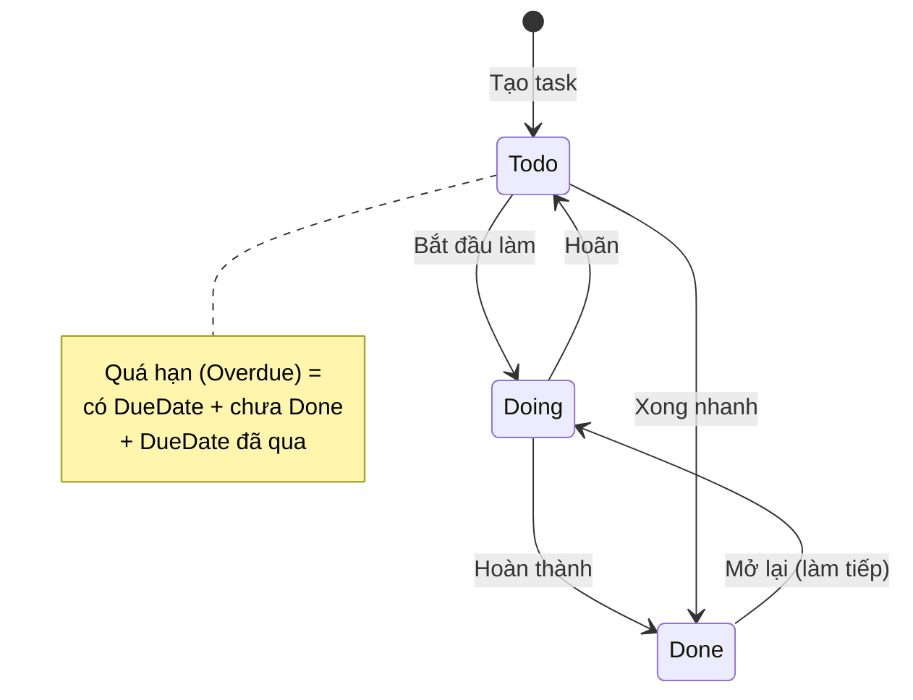
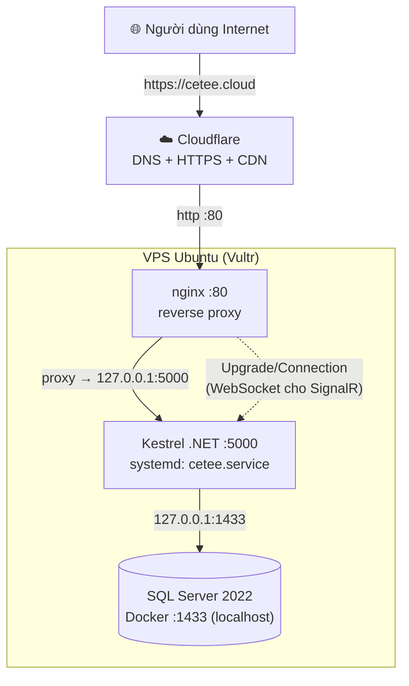

# Sơ đồ tổng hợp — ERD & Luồng hoạt động (Mermaid)

> Các sơ đồ dưới đây viết bằng **Mermaid**, hiển thị trực tiếp trên GitHub, VS Code
> (cài extension *Markdown Preview Mermaid Support*) hoặc dán vào <https://mermaid.live>
> để xuất ảnh PNG/SVG chèn vào slide báo cáo.

## Mục lục

1. [ERD — Sơ đồ quan hệ thực thể (toàn hệ thống)](#1-erd--sơ-đồ-quan-hệ-thực-thể)
2. [Kiến trúc MVC 3 tầng](#2-kiến-trúc-mvc-3-tầng)
3. [Cây phân cấp tổ chức (Hierarchy)](#3-cây-phân-cấp-tổ-chức-hierarchy)
4. [Luồng Đăng nhập (Identity Cookie)](#4-luồng-đăng-nhập-identity-cookie)
5. [Luồng Đăng nhập Google OAuth2](#5-luồng-đăng-nhập-google-oauth2)
6. [Luồng Quên mật khẩu (OTP + JWT)](#6-luồng-quên-mật-khẩu-otp--jwt)
7. [Luồng Tạo Task + Giao việc + Thông báo + Realtime](#7-luồng-tạo-task--giao-việc--thông-báo--realtime)
8. [Luồng Xếp lịch kéo thả (Timeline AJAX)](#8-luồng-xếp-lịch-kéo-thả-timeline-ajax)
9. [Vòng đời trạng thái Task (State)](#9-vòng-đời-trạng-thái-task-state)
10. [Sơ đồ triển khai (Deployment)](#10-sơ-đồ-triển-khai-deployment)

---

## 1. ERD — Sơ đồ quan hệ thực thể

Sinh từ cấu hình quan hệ trong [Data/AppDbContext.cs](../Data/AppDbContext.cs).

> 💡 Hành vi xoá (`AppDbContext`): `Workspace→Project→Task/Page`, `Task→Assignee/Comment`,
> `User→Notification/ActivityLog/PasswordResetCode` là **Cascade**; quan hệ tới `User`
> ở các bảng nối và `Manager` tự tham chiếu dùng **Restrict** để tránh *multiple cascade
> paths* của SQL Server (xoá user/manager thì gỡ liên kết thủ công trước).

---

## 2. Kiến trúc MVC 3 tầng

---

## 3. Cây phân cấp tổ chức (Hierarchy)

Phạm vi nhìn thấy: mỗi cấp thấy **đội của mình, sâu tối đa 2 cấp** (xem
[UserService.VisibleUsers](../Services/UserService.cs)).

> Admin *Kỹ thuật* thấy `M1, M2` (trực tiếp) **và** `U1, U2` (qua M1) — nhưng **không**
> thấy đội của Admin *Kinh doanh*. User độc lập đứng ngoài cây, tự quản việc cá nhân.

---

## 4. Luồng Đăng nhập (Identity Cookie)

---

## 5. Luồng Đăng nhập Google OAuth2

---

## 6. Luồng Quên mật khẩu (OTP + JWT)

---

## 7. Luồng Tạo Task + Giao việc + Thông báo + Realtime

---

## 8. Luồng Xếp lịch kéo thả (Timeline AJAX)

---

## 9. Vòng đời trạng thái Task (State)

---

## 10. Sơ đồ triển khai (Deployment)

Chi tiết xem [10-Deploy-len-Internet.md](10-Deploy-len-Internet.md).

---

> 📌 **Gợi ý dùng cho slide:** xuất ERD (mục 1) và 1–2 sơ đồ luồng tiêu biểu (mục 4–7)
> ra ảnh tại <https://mermaid.live>. Sơ đồ kiến trúc (mục 2) và triển khai (mục 10) hợp
> làm slide mở đầu và kết thúc phần kỹ thuật.
